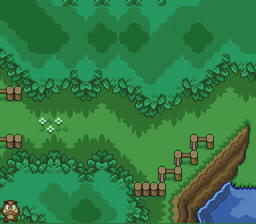
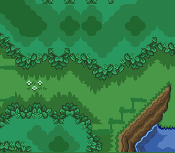
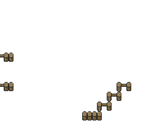
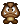
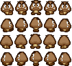

# Prática: Sprites



Pré-requisitos:

1. Assistir [o vídeo promocional][promo] do _framework_ de jogos LibGDX
1. Conhecimento de Java
   - Um ambiente de desenvolvimento:
   - NetBeans com plugin _Gradle Support_

Objetivos:

1. Familiarizar-se com o funcionamento da LibGDX
1. Conhecer técnicas comuns de renderização em 2D - Sprites, Animações etc.
1. Praticar conceitos de renderização em 2D na LibGDX
   - Uso de texturas
   - Sprites
   - Animações
1. Entender a importância de se reduzir o número de "chamadas de desenho"
  (_draw calls_)

## Atividade Prática

Você deve começar usando o código do professor como ponto de partida para a
atividade. Você deve fazer 3 exercícios:

### Exercício 1: completar o cenário

Desenhar o cenário como duas texturas (`Texture`), uma em cima da outra,
carregando `map-level-1.png` e `map-level-2.png` (dentro do método
`void create()`) e mandando desenhar (dentro do `render()`) na posição (0, 0) -
canto inferior esquerdo.

- `map-level-1.png` (**nível 1**: o chão - já está lá)

  
- `map-level-2.png`: (**nível 2**: as cerquinhas)

  
- **Nota:** tipicamente, um cenário em um jogo bidimensional é
  formado por um _grid_ de _tiles_, como no RPG Maker/Boss. Contudo,
  neste exercício, vamos simplesmente desenhar uma imagem "inteira" em cima
  da outra.

### Exercício 2: desenhando o Goomba como `Sprite`



Criar uma `Sprite` para o Goomba usando `goomba.png` (sem animação ainda) que
pode ser controlada pelo teclado (via setinhas):

1. Defina membros na classe `Game` para a `Sprite` e para a `Texture` e as
   instancie devidamente.
   - Assim que instanciar a sprite, defina sua posição para (30, 10).
1. Desenhe a sprite entre os níveis 1 e 2 do cenário


### Exercício 3: controle do movimento

Agora você deve possibilitar o jogador a controlar a posição do Goomba.

1. Na função `update()`, quando o jogador pressionar alguma das setas
   do teclado, altere a posição da sprite de acordo.
   - Como exemplo, veja como o pressionar da tecla <kbd>Esc</kbd>
     está encerrando o jogo
1. Faça uma verificação da nova coordenada da sprite para que o
   personagem não saia da tela
   - Basta garantir que sua posição `x` está entre
     [`0`, `LARGURA_DA_TELA - LARGURA_GOOMBA`] e o análogo para `y`
     - Para pegar a largura e altura da janela podemos usar `Gdx.graphics.getWidth()` e `Gdx.graphics.getHeight()`
     - Esta não é uma solução boa (redimensione a janela e veja o que
       acontece), mas por ora está ok.


### Exercício 4: refatorando o código do Goomba

A esta altura, o código de `Game` está um pouco bagunçado e, então, você deve
organizá-lo. A ideia é criar uma classe `Goomba` que vai conter o código
relacionado ao personagem, e a `Game` vai conter uma instância dela e vai
passar a chamar seus métodos.

1. Crie uma classe `Goomba`, com um construtor que recebe apenas a textura
   do Goomba.
1. Crie métodos `update()` e `render(batch)`, com seus respectivos códigos.
1. Mova o código de `update()` e `render()` relativo ao Goomba de `Game`
   para `Goomba` e, então, chame os métodos do `Goomba` em `Game`.


### Exercício 5: animação do Goomba

Nesta parte, você deve colocar uma animação de movimentação do Goomba. Na
LibGDX existe a classe `Animation` que representa "algo que vai trocando
ao longo do tempo" - é basicamente um _array_ de quadros com um índice de
qual é o quadro corrente, que vai trocando ao longo do tempo.

Ao usar `Animation`, não será mais possível usar a `Sprite`, porque elas são
incompatíveis (na LibGDX - um erro de projeto do _framework_, na opinião
do professor). Portanto, vamos comentar o código da `Sprite` dentro de `Goomba`
e precisar gerenciar a posição do `Goomba` nós mesmos.



- Configuração da _spritesheet_:
  - Largura do quadro: `21px`
  - Altura do quadro: `24px`

Sugestão de passos:

1. Comente todo o código relativo à `Sprite` em `Goomba`
1. Em `Game` `create()`, instancie a textura da _spritesheet_ e passe-a para o
   `Goomba` pelo construtor
1. Nele, divida a textura em vários quadros usando
   `TextureRegion.split(textura, larguraDoQuadro, alturaDoQuadro)`
   - Uma `TextureRegion` é um pedaço retangular de uma textura, i.e., um
     quadro
1. Defina um membro do `Goomba` e instancie uma animação (no construtor)
   com os 5 quadros da primeira linha da _spritesheet_, com um intervalo de
   tempo de 0.1f segundo
   - Configure a animação para ficar em loop e em modo de ping-pong (vai da
     esquerda para a direita, depois volta para a esquerda):
     ```java
     andarParaFrente.setPlayMode(PlayMode....);
     ```
1. Crie um membro em `Goomba` que receberá o tempo que o Goomba está em
   animação (i.e., `private float tempoDaAnimacao;`).
   - Em `update(delta)`, some nela o tempo passado desde o último quadro.
   - Durante o `render()`, em vez de desenhar a `Sprite` (que agora está
     comentada), desenhe o quadro corrente da animação
     - Repare que não sabemos mais qual é a posição (x,y) do Goomba, visto que
       não podemos usar a `Sprite` junto com animações.
     - Sendo assim, você deve criar um membro `private Vector2 position` e
       "gerenciar" a posição do Goomba você mesmo.

### Desafio 1: animação em 4 direções

Em vez de ter apenas uma animação, faça com que o Goomba tenha a animação
relativa à direção para onde ele está andando. Além disso, faça ele parar
a animação quando estiver parado.

**Dica:** será necessário ter 4 `Animation`s diferentes, uma para cada
direção. Além disso, você pode ter mais uma `Animation` que é um ponteiro
para qual das 4 é a animação corrente.

[promo]: https://libgdx.badlogicgames.com/

---
## Entrega

~~Este trabalho deve ser entregue **via Moodle**. Mas caso o Moodle ainda
não esteja funcionando de vento em polpa,~~ considere o parágrafo a seguir.

Os exercícios desta aula prática serão corrigidos ao final do nosso horário.
Assim que estiver pronto, chame o professor para que possa ver seu trabalho.

## FAQ

1. Como desenho uma textura na LibGDX?
   - É necessário (1) carregar a textura para depois (2) desenhá-la:
     1. Carregando a textura dentro do `create()`:
        ```java
        @Override
        public void create() {
            batch = new SpriteBatch();
            algumaTextura = new Texture("nome-do-arquivo");
        }
        ```
     1. Desenhando no `render()`, em alguma posição:
        ```java
        @Override
        public void render() {
            // ...
            batch.begin();
            batch.draw(algumaTextura, x, y);
            batch.end();
        }
        ```
1. Qual a diferença entre uma **`Texture`** e uma **`Sprite`** na LibGDX?
   - Uma **`Texture`** é apenas uma imagem que foi carregada pela placa de
     vídeo. É possível desenhar uma textura, em determinada posição, usando um
     SpriteBatch, e.g.:
     ```java
     batch.begin();
     batch.draw(algumaTextura, 25, 0);
     batch.end();
     ```
   - Uma **`Sprite`** é um objeto que possui uma textura e uma posição no
     mundo. Diferentemente da textura, a sprite "sabe se desenhar" porque
     ela sabe onde está posicionada:
     ```java
     // dentro de update()
     algumaSprite.setPosition(100, 25);
     // ...
     // ...
     // dentro de render()
     batch.begin();
     algumaSprite.draw(batch);
     batch.end();
     ```
1. Como funciona essa `Animation` mesmo?
   - Veja os slides da aula, ou então este
     [breve tutorial sobre animação na LibGDX][tutorial-animacao].   
1. Não existe uma classe `AnimatedSprite` na LibGDX?
   - Na LibGDX não, mas você pode criar a sua, que herde da `Sprite` da
     LibGDX. Na verdade, um membro da comunidade já fez isso e disponibilizou
     tal classe juntamente com outros utilitários do
     [projeto `gdx-utils`][gdx-utils] (veja
     [como "instalar"][gdx-utils-instalar]).
   - A `AnimatedSprite` da `gdx-utils`, no entanto, contém apenas 1 animação.
     Mas, no nosso caso, temos 4 animações. Para não precisar de criar
     4x `AnimatedSprite`, você pode criar uma `MultiAnimatedSprite`, que
     herde de `AnimatedSprite` mas possa trabalhar com várias animações
     diferentes.
     - Na verdade, o professor já criou uma
       [classe `MultiAnimatedSprite`][multi-animated-sprite],
       que você pode usar, se quiser.

[tutorial-animacao]: http://www.gamefromscratch.com/post/2013/12/09/LibGDX-Tutorial-3B-Simple-Animation.aspx
[gdx-utils]: https://bitbucket.org/dermetfan/libgdx-utils/wiki/net.dermetfan.gdx.graphics.g2d.AnimatedSprite
[gdx-utils-instalar]: https://bitbucket.org/dermetfan/libgdx-utils/wiki/Dependency%20Instructions
[multi-animated-sprite]: https://github.com/fegemo/cefet-games-brushmyteethplz/blob/master/core/src/br/cefetmg/games/graphics/MultiAnimatedSprite.java#L11
