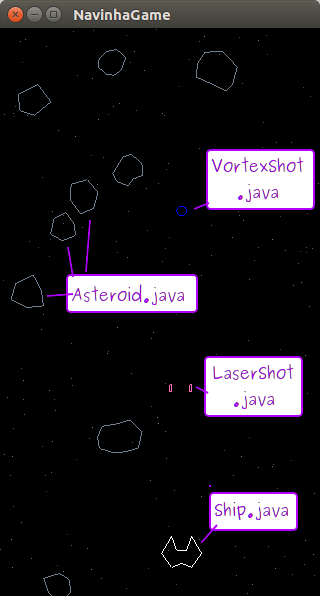

# cefet-games-navinha

Um jogo de navinhas destruindo asteróides.

## Descrição

Este é um jogo em que se controla uma nave que deve atirar nos asteróides...
para sempre. E sem contar pontos. Com uma navinha imortal.



### Funcionamento

Atualmente, o jogo está funcionando mas nenhum objeto colide com o outro.
Esta atividade prática consiste em implementar os métodos que verificam
se houve colisão entre objetos.

Os asteróides vão indo na direção da nave, que deve destruí-los ou desviar
deles. Quando um asteróide é destruído ou sai da tela, ele é "reciclado":
seu objeto na RAM é reaproveitado, recebendo uma nova forma, tamanho e
posição acima da tela. Quando um asteróide atinge a nave do jogador ele
também é reciclado.

Um tiro é adicionado a uma lista (`Array`) quando disparado e removido
dela quando (i) ele sai da tela ou (ii) ele atinge um asteróide.

### Detalhes da Implementação

Não foram usadas imagens neste jogo, portanto, não foi usada uma
`SpriteBatch`. Todos os objetos estão sendo desenhados como primitivas do
OpenGL: pontos, polígonos, linhas etc.

A LibGDX possui o `ShapeRenderer` que expõe funções de desenho
dessas primitivas.

Um exemplo de uso do `ShapeRenderer` para desenhar um tiro a laser:

```java
public class LaserShot {
  //...
  public void render(ShapeRenderer renderer) {
    renderer.setColor(Color.PINK);
    renderer.identity();
    renderer.translate(position.x, position.y, 0);
    renderer.rect(-WIDTH / 2F, -HEIGHT / 2F, WIDTH, HEIGHT);
  }
  //...
}
```

### Controles

Os controles implementados são:
- <kbd>←</kbd>, <kbd>→</kbd>: vai para esquerda e direita
- <kbd>d</kbd>: ativa/destiva modo de _debug_
  - Quando em _debug_, os _colliders_ de cada entidade são desenhados
- <kbd>Espaço</kbd>: atira usando a arma corrente
- <kbd>Tab</kbd>: troca para a próxima arma
- <kbd>+</kbd>, <kbd>-</kbd>: acelera/desacelera as estrelinhas
- <kbd>Esc</kbd>: sai do jogo

## Atividade

Esta atividade está dividida em 2 exercícios e 1 desafio. Você deve
implementar, na classe `Collision.java`, os métodos para verificar
a colisão de círculo com círculo (`boolean circlesOverlap(Circle c1,
Circle c2)`) e retângulo com retângulo (`boolean rectsOverlap(Rectangle r1,
Rectangle r2)`), sem usar a implementação da própria LibGDX para tal
(`rect1.overlaps(rect2)` e `circle1.overlaps(circle2)`).

A classe `Collision.java` está assim:

```java
public class Collision {
  public static final boolean circlesOverlap(Circle c1, Circle c2) {
    return false;
  }
  public static final boolean rectsOverlap(Rectangle r1, Rectangle r2) {
    return false;
  }
}
```

Lembre-se de que é interessante usar os métodos de vetores da geometria
analítica que já implementados em `Vector2` (e `Vector3`) da LibGDX. Veja
a [documentação do `Vector2`][vector2].


### Exercício 1: círculo _vs_ círculo

Para calcular a colisão entre alguns objetos, implemente na classe `Collision`
o método `circlesOverlap` considerando:

- Círculos colidem se a distância entre eles é menor que a soma de seus raios
- _Nota: tente fazer essa verificação sem usar a operação de radiciação_

### Exercício 2: retângulo _vs_ retângulo

Agora, implemente o método `rectsOverlap` considerando:

- Colidem se todos os eixos (x, y, z?) colidem
- Um eixo está em colisão se a<sub>max</sub> ≥ b<sub>min</sub> e
  a<sub>min</sub> ≤ b<sub>max</sub>
- Um retângulo possui uma posição que indica seu canto esquerdo-inferior.


### Desafio 1

Crie um método e o implemente (em `Collision.java`) que verifique se houve
colisão entre um círculo e um retângulo. Um caso de uso seria a colisão entre
o tiro laserShot e um asteróide.

Para tanto, você deve também alterar `LaserShot.java` para usar esse novo
método de detecção de colisão. Use a funcionalidade de _debug_ do jogo
para verificar se está funcionando.

[vector2]: https://libgdx.badlogicgames.com/nightlies/docs/api/com/badlogic/gdx/math/Vector2.html
[shape]: https://libgdx.badlogicgames.com/nightlies/docs/api/com/badlogic/gdx/graphics/glutils/ShapeRenderer.html
