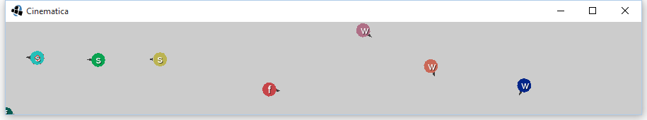
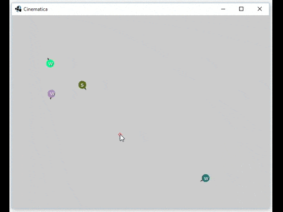
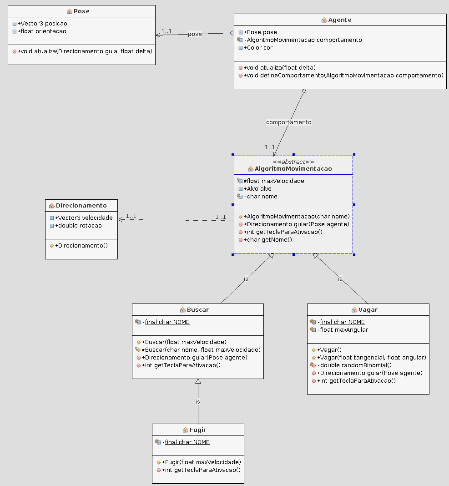

# Prática: Movimentação Cinemática



Objetivos:

  1. Enxergar a movimentação de agentes como um algoritmo
  1. Praticar algoritmos de movimentação simples usando cinemática

## Atividade Prática

Você deve começar usando o código do professor como ponto de partida para a
atividade. Você deve implementar 3-4 algoritmos simples de movimentação, que
usam conceitos de cinemática da física (posição, velocidade e, no máximo,
aceleração constante). Os algoritmos são:

1. **Buscar (_seek_)**
1. **Fugir (_flee_)**
1. **Vagar (_wander_)**
1. **Chegar (_arrive_)**

## Resultado Esperado



## _Background Teórico_

Descrevemos um **Agente** (`Agente.java`) por:

1. Pose
   1. Posição
      - Vetor 2-dimensional com as coordenadas do agente
   1. Orientação
      - Um escalar (entre 0 e 2&pi;) representando para onde o agente
        está olhando
1. Algoritmo de movimentação (comportamento)
1. Cor

As principais classes do programa podem ser vistas no diagrama a seguir:



A movimentação acontece em dois passos:

1. Passo de IA: Um algoritmo de movimentação (_e.g._, _seek, wander_)
   determina para onde o agente deve ir
1. Passo de Física: Usamos integração de Euler para atualizar a posição do
   agente de acordo com o movimento do passo anterior (veja
   `Pose.java:atualiza` - isto já está implementado)
   - Em cada _frame_ de atualização:
     ```java
     posicao += velocidade * delta;
     orientacao += rotacao * delta;
     ```

O algoritmo de movimentação cinemático tem como:

- **Entrada**: dados estáticos (posição, orientação do agente) e,
  opcionalmente, um alvo
- **Saída**: um `Direcionamento` (_steering_) com um vetor velocidade linear
  e/ou escalar de velocidade angular

Os algoritmos que vamos implementar:

1. **Busca**: agente recebe uma posição objetivo
   - Calcule a direção desejada
     - Considere a posição do objetivo e a posição do agente
   - Normalize o vetor direção, mas multiplique-o pela velocidade máxima
1. **Fuga**: sentido contrário da busca
1. **Vagar**:
   - Agente sempre na velocidade tangencial máxima
   - Direção sofre pequenas variações aleatórias a cada quadro
1. **Chegar**: variação da Busca
   - Determinar um pequeno "raio de satisfação"
   - Parar assim que chegar no raio

## FAQ

1. Quais são valores interessantes para a velocidade máxima?
   - Algo entre 20 e 60 px/segundo
1. Quais são os controles?
   - Botão ESQUERDO: cria novo agente na posição clicada, com o algoritmo
     de movimentação corrente
   - Botão DIREITO: define onde/quem é o alvo
   - Rodinha: zoom
1. Como defino quem é o algoritmo corrente?
   - Cada `AlgoritmoMovimentacao` possui um nome (uma letra apenas) e uma
     tecla que o torna o algoritmo corrente. Basta pressioná-la. Elas são:
     - `s`: buscar (_seek_)
     - `w`: vagar (_wander_)
     - `f`: fugir (_flee_)
1. Onde está a classe referente ao `Chegar`?
   - Ela não existe e você deve criá-la.
   - Na classe `Cinematica.java` (a principal), no método `create()`, você
     deve instanciar, configurar e registrar um objeto do tipo `Chegar`
     para poder usar esse novo algoritmo.
     
---
## Entrega

Este trabalho deve ser entregue **via Moodle** como um link para o seu _fork_
do repositório original, com a atividade feita.

Os exercícios desta aula prática serão corrigidos ao final do nosso horário.
Assim que estiver pronto, chame o professor para que possa ver seu trabalho.
