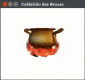
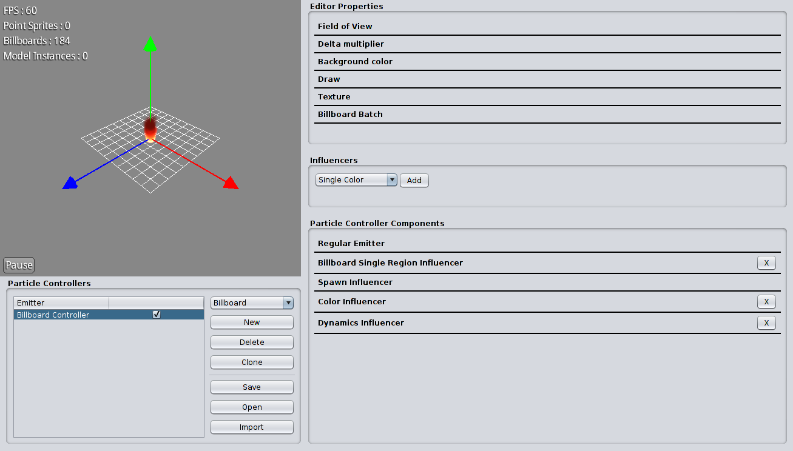

# cefet-games-cauldron

Um caldeirão para se fazer poções mágicas incríveis.

## Composição da Cena

A cena é composta por dois modelos 3D chamados `fogueira.obj` e `caldeirao.obj`.
Uma fonte de luz foi colocada na cena e também foi configurada a luz ambiente
com intensidade de 40%.



Deve haver dois efeitos de partículas na cena, sendo um para o fogo sob
o caldeirão e o outro para as borbolhas da sopa.

## Exercício

Ao fazer seu _fork_, clonar e executar a aplicação, a fogueira e o efeito de
partículas do fogo (`fogo.pfx`) já estão funcionando, mas o das
borbolhas (`bolhas.pfx`) não.

Este exercício é composto por 3 etapas:

1. Integrar o efeito de borbolha (que já está pronto, no
   arquivo `bolhas.pfx`) da sopa na aplicação
1. Estilizar o efeito do fogo para criar a poção mágica que você precisa (
   escolha uma ou duas):
   - **Poção do amor**: fogo vermelho, com movimentação selvagem, traz a pessoa
     amada em 5 dias
   - **Poção da realeza**: fogo amarelado, intensidade alta mas pouco movimento,
     torna-o rico no mesmo ano
   - **Poção da nota alta em jogos**: fogo esverdeado, movimentando-se em espiral,
     faz tirar nota bacana na melhor matéria do curso
   - **Poção da moléstia**: fogo acinzentado escuro, super intenso e movimentando
     apenas verticalmente, acomete a pessoa alvo com um resfriado leve
   - **Poção da criatividade**: de acordo com o alunalquimista
1. Estilizar a borbolha (quantidade de bolhas, frequência de surgimento, cor) e
   a sopa (alterar a textura `caldeirao-sopa.jpg`) com a cor da poção sendo criada
   - Só não vale a poção "de chocolate" padrão

## Editor Flame



O Flame é o editor de efeitos de partículas 3D da LibGDX. Para executá-lo, siga
as instruções no FAQ.

A LibGDX possui os seguintes conceitos:

- **Sistema de partículas**: classe `ParticleSystem`, é um objeto único
  responsável pelo gerenciamento de todos os efeitos de partículas. Ele é
  instanciado apenas 1x por cena e é ele quem é atualizado e renderizado.
- **Efeito de partículas**: classe `ParticleEffect`, representa um efeito de
  partícula em específico. Pode ser posicionado (rotacionado e escalado
  também) e é adicionado ao sistema de partículas:

  ```java
  sistemaParticulas.add(efeitoDeFogo);
  ```
  - O efeito de partículas é descrito em um arquivo com extensão `.pfx`
    (_particle effects_). Esse arquivo contendo esse efeito pode ser criado
    usando o editor Flame.
- **Renderizador de partículas**: classes `BillboardParticleBatch`,
  `PointSpriteParticleBatch` e outras. Existem pelo menos 3 tipos de
  partículas: _sprites_ simples, _billboards_ e modelos tridimensionais. Cada
  tipo possui um objeto renderizador e, para nosso exercício, estamos usando
  (já estão instanciados e configurados) um renderizador de _sprites_ e outro
  de _billboards_.


## FAQ

1. Como posso visualizar e criar um efeito de partícula?
   - Na página de [ferramentas][tools] da LibGDX há um _link_ para o
     editor de partículas 3D. [Baixe-o][3d-editor].
   - Findo o _download_:
     - no Windows basta executar o arquivo `.jar`
     - no Linux, defina o arquivo `.jar` como executável e então execute-o
       pela interface gráfica ou pela linha de comando:

       ```
       chmod +x runnable-3D-particles.jar
       java -jar runnable-3D-particles.jar
       ```
1. Como instancio efeitos de partículas dentro do jogo?
   - Siga os passos descritos no próprio código ou então
     leia [este tutorial oficial][tutorial]

[tools]: https://libgdx.badlogicgames.com/tools.html
[3d-editor]: https://libgdx.badlogicgames.com/nightlies/runnables/runnable-3D-particles.jar
[tutorial]: https://github.com/libgdx/libgdx/wiki/3D-Particle-Effects
