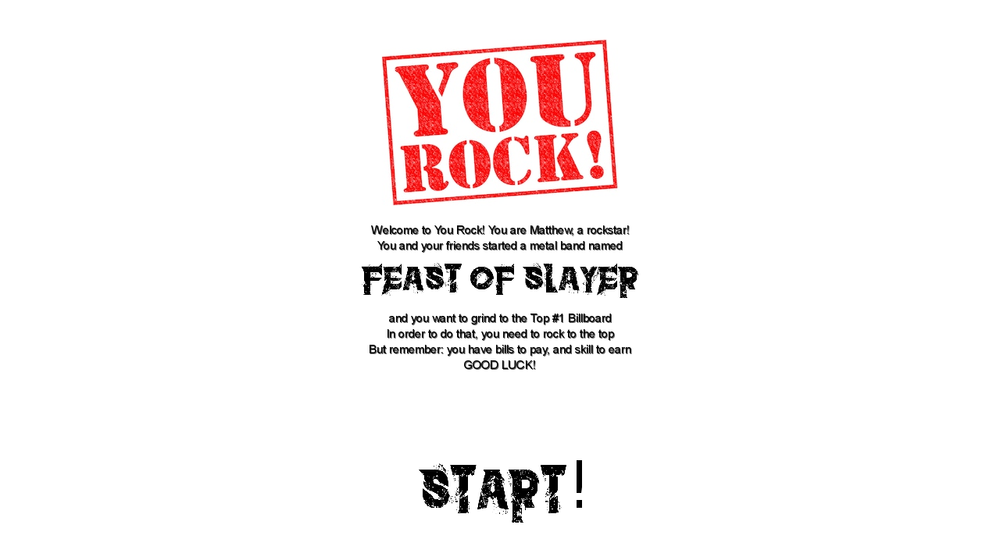
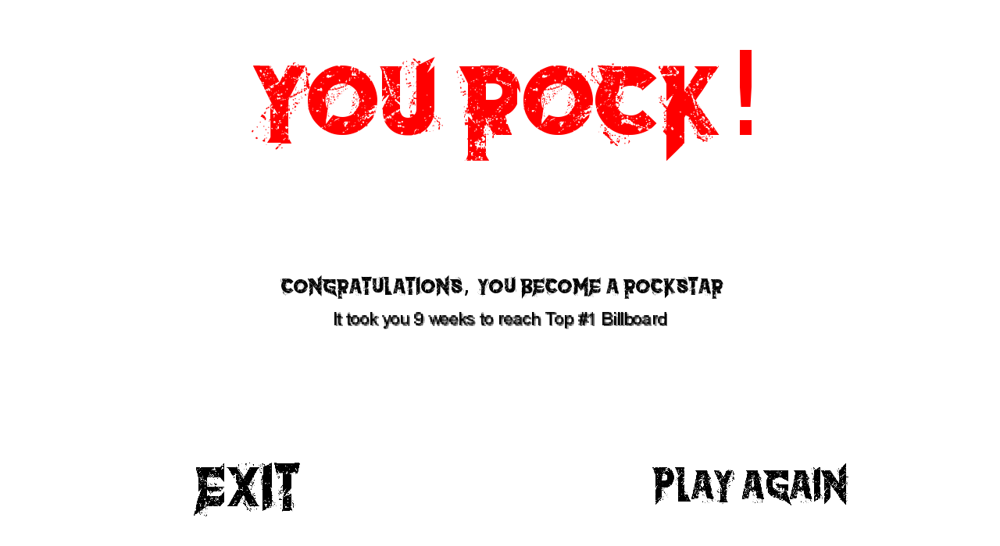

# You Rock!

  

## O Jogo:
You Rock é um auto-game gerenciador de recursos. Você está na pele de Matthew, um cara comum que montou com seus amigos uma banda de metal, e vocês querem alcançar o Top #1 da Billboard!

## Como jogar:
É simples! Toda semana você tem que programar sua rotina, escolhendo entre as atividades que você pode executar. Entre elas:
- Trabalhar;
- Praticar o instrumento;
- Ensaiar com a banda;
- Fazer shows;
- Jogar video-game (ninguém é de ferro)
Você pode também mudar de ideia sobre certa atividade. Para removê-la do seu cronograma semanal, basta clicar nela com o botão direito.

### Você consegue alcançar o Top #1 da Billboard?

  

